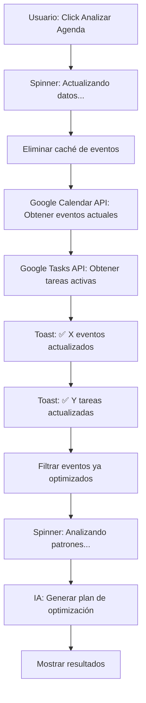

# ✅ Feature: Actualización Automática de Datos Antes de Optimización

## 🎯 Funcionalidad Implementada

He agregado **actualización automática de datos** antes de ejecutar la optimización de agenda con IA.

### ¿Qué hace?

Cuando haces clic en **"🧠 AI: Analizar Agenda Completa (Eventos + Tareas)"**, el sistema ahora:

1. ✅ **Limpia el caché** de eventos guardados en sesión
2. ✅ **Re-importa eventos frescos** desde Google Calendar (basado en las fechas seleccionadas)
3. ✅ **Re-obtiene tareas activas** desde Google Tasks  
4. ✅ **Muestra notificaciones** de cuántos items se actualizaron
5. ✅ **Filtra eventos ya optimizados** del historial
6. ✅ **Ejecuta la optimización** con los datos más recientes

### 🔍 Por qué es importante

**Antes (❌ Problema)**:
- El optimizador usaba eventos guardados en caché de session_state
- Si borrabas un evento en Google Calendar, seguía apareciendo en la optimización
- Eventos "fantasma" causaban errores o confusión

**Ahora (✅ Solución)**:
- Cada vez que presionas "Analizar Agenda", se obtienen datos **frescos**
- No más eventos borrados en la lista de optimización
- Siempre trabajas con la versión más actualizada de tu calendario

## 📋 Flujo de Trabajo



## 🛠️ Cambios Técnicos

**Archivo modificado**: `app.py` - Función `view_optimize()`  
**Líneas**: 2523-2575 (aprox)

### Código agregado:
```python
# === FORCE REFRESH: Clear cache and reimport data ===
with st.spinner("🔄 Actualizando datos desde Google Calendar/Tasks..."):
    # Clear cached events
    if 'opt_events' in st.session_state:
        del st.session_state['opt_events']
    
    # Reimport fresh data
    service = get_calendar_service()
    if service:
        # ... (reimport con API de Google Calendar)
        st.toast(f"✅ Datos actualizados: {len(events_to_optimize)} eventos")
    
    # Refetch tasks as well
    task_svc = get_tasks_service()
    if task_svc:
        tasks = get_existing_tasks_simple(task_svc)
        st.toast(f"✅ Tareas actualizadas: {len(tasks)}")
```

## 🎯 Beneficios

✅ **Datos siempre actualizados** - No más eventos/tareas cacheadas  
✅ **No más items borrados** en la optimización  
✅ **Feedback visual** - Toasts muestran cuántos items se cargaron  
✅ **Mejor experiencia** - Usuario confía en que los datos son correctos  
✅ **Menos errores** - Elimina el problema de IDs inválidos por items eliminados  

## 🚀 Cómo Usar

1. Ve a **⚡ Optimizador de Agenda**
2. Selecciona el rango de fechas
3. (Opcional) Click en "📥 Importar Período Seleccionado" si quieres ver los datos primero
4. Click en **"🧠 AI: Analizar Agenda Completa"**
5. Observa los toasts de actualización ✅
6. Revisa los resultados de optimización con datos frescos

## 📊 Ejemplo de Uso

**Escenario**:
- Tienes 50 eventos en tu calendario
- Borras 5 eventos directamente en Google Calendar
- Vuelves a la app y presionas "Analizar Agenda"

**Resultado**:
- 🔄 Sistema detecta y actualiza automáticamente
- ✅ Toast: "45 eventos actualizados" (sin los 5 borrados)
- 🧠 IA analiza solo los 45 eventos que realmente existen
- ✅ No hay errores de "Invalid ID"

---

**Desarrollado por**: Antigravity AI Assistant  
**Commit**: `b57b418`  
**Fecha**: 30 de Enero, 2026 - 02:20 AM
